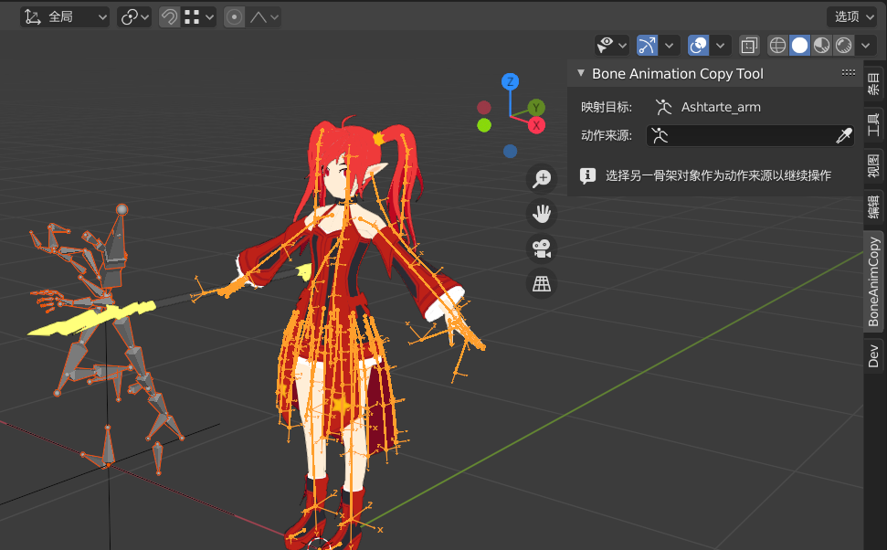
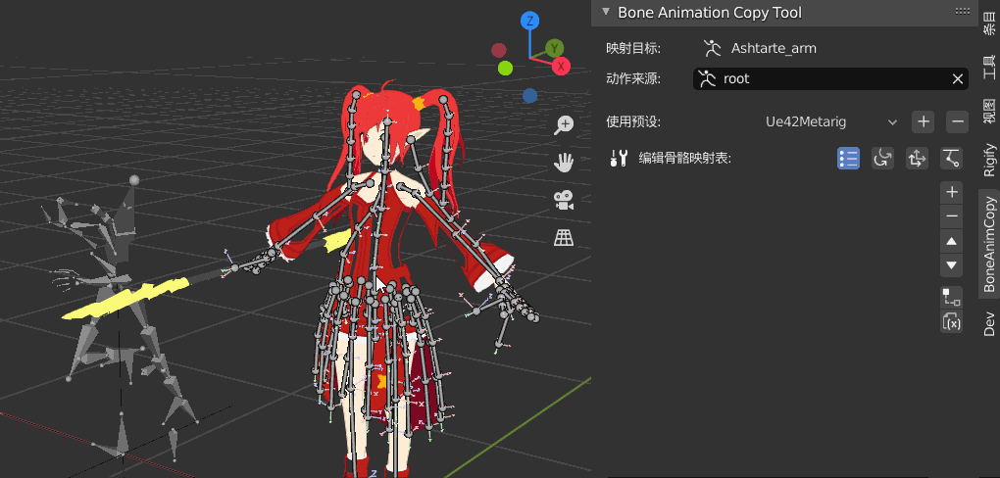
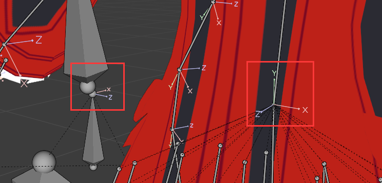
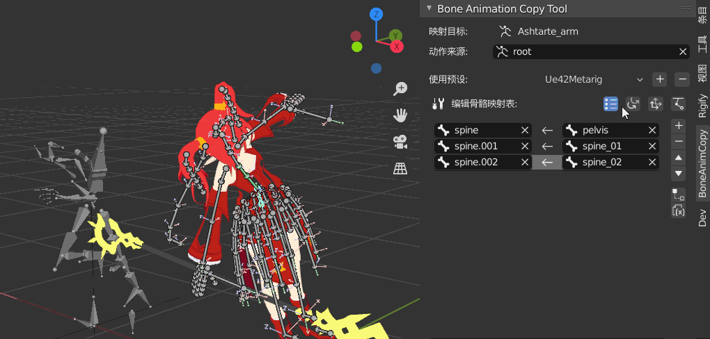
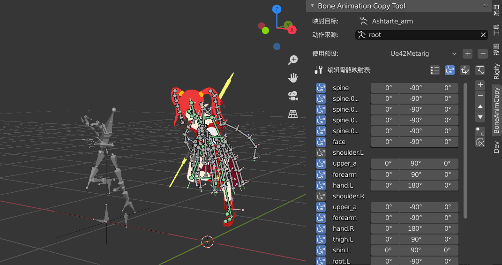
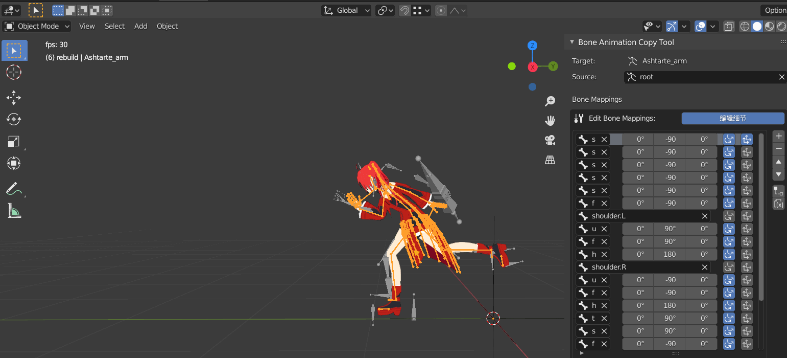
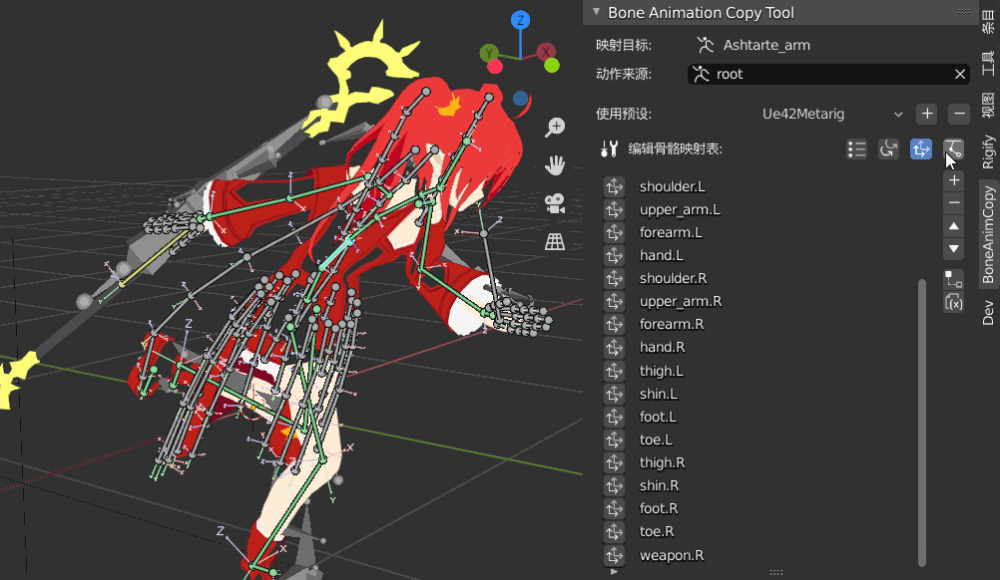
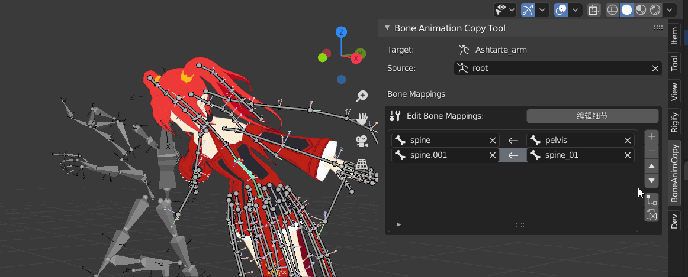

# BoneAnimCopy Tool
## 这是什么？
这是一个用于在blender中桥接骨骼动画的插件

制作灵感来源于b站up主 
[露伴知了](https://space.bilibili.com/260963472) 
制作的
[解锁FBX动作融合](https://www.bilibili.com/video/BV1GE411i7j3
) 
系列教程，通过骨骼约束来映射动作的思路非常简单泛用。

我在此基础上进一步研究了骨骼轴向差异等问题的解决方法，并整合成了这个插件来将相关的设置操作简化。希望这一思路能被进一步开发，让更多苦于动作制作的繁琐的独立动画/游戏制作者得到便利。

## 实现原理
暂时没时间写……

## 使用说明
### 基本功能
#### 旋转映射
安装并注册插件后，可以在3D视图的右侧看到插件面板。在未选中骨架对象时并不会提供任何功能。

导入一个人物模型以及一个想要映射动作到人物身上的带动作的骨架。我这里使用的是UE4骨架的跑步动作。

点选角色的骨架，右侧面板就会开始显示相关功能。**映射目标**必然是选中的骨架自身，**动作来源**则可以在场景中选取任意其它骨架。

不过，切换来源骨架时的适配操作我还没详细测试，最好选中一个后就不要改了。

将刚才导入的跑步动作骨骼设为**动作来源**之后，完整的插件面板就会展开。下方的**骨骼映射表**是本插件的核心，用于编辑目标和源之间的骨骼对应关系，从而实现骨骼变换的映射。

右侧纵向排列的前四个按钮就是一个blender列表界面的基础增、删、上下移动功能，这里先点击【+】新建一个mapping，将两个模型的根骨骼，也就是第一根脊椎骨建立对应关系，就可以看到目标骨骼跟源骨骼一样指向了斜上方。

除了凭空添加空白mapping，也可以先在姿态模式下选中一个或多个骨骼，再点击【+】就会批量生成并自动填入目标

#### 旋转修正
现在我们发现，人物映射动作后的朝向和跑步姿势并不吻合，这是由于人物的骨架和UE4骨架的轴向不同。因此需要额外进行旋转修正

在骨骼映射表上方还有四个横向排列的按钮，之前编辑映射关系时默认选择的是第一个。现在我们点击第二个按钮进入旋转修正的编辑模式，就可以通过映射表每一行左侧的按钮来激活对应骨骼的旋转修正，并设置偏移的角度。
blender的骨骼都是以y轴作为延伸方向，大多数情况下只需要修正y旋转。

映射好所有需要的骨骼后就可以让角色大致地模仿出另一骨架的动作了

#### 位置映射
之前的步骤只复制了旋转信息，因此跑步也只能在原地跑，要想把位移也一起复制的话，就需要点击第三个按钮，进入位置映射的编辑模式。同样是点击左侧的按钮从而在特定骨骼上激活。

位置映射尚需进一步完善，现在只是简单地复制世界坐标，实际使用中如果能进行一定的偏移可能会更好。

#### IK修正
仅依靠旋转来映射动作的话，手和脚的最终位置会受到关节长度的影响，在上一张图中可以看到角色的脚并没有准确地踩在地上。想修正这点的话可以点击第四个按钮进入IK修正的编辑。激活脚掌和手掌骨骼的IK修正，就可以更准确地模仿来源骨架的动作。

不过要注意的是，骨架的身高差异有可能会对手的IK修正效果产生影响，并不是应用了IK效果就一定更好，具体还是要在实践中体会。

#### 保存预设
辛辛苦苦设定好对应关系调好角度后，就可以保存预设，之后在映射相同种类的两种骨骼时就能一键解决。操作方法也很明显，就不多说了。

### 额外功能
插件的基本工作方式就是以上四种，实操一遍之后你会发现其实大部分的工作量还是在设定骨骼的对应关系上。因此除了一对对建立关系，插件也正在寻找一些提高映射效率的操作。

#### 子级映射
很多时候当一对骨骼建立映射之后，它们各自的子级也是需要映射的。根据这个规律我做了一个通过父级来快速联系子级的功能。

在列表中选中一条有效的mapping后，点击【子级映射】就会自动对子级进行判断。如果源和目标骨骼各自都只有一个子级，就会直接生成一条子级间的mapping。对于一连串的脊椎，它可以便捷地建立一整条映射。

如果源和目标的子级并非只有一个，则会为目标骨骼的所有子级各生成一条源骨骼为空的mapping，剩下的就仍然需要手动填入。

#### 名称映射
顾名思义，如果需要建立映射的两根骨骼命名相似甚至完全一致的话，那直接对比名称就可以自动挑选对应骨骼了？

不过实际使用效果并不好……单纯对比字符串相似度的话准确率还是太低，毕竟骨骼的命名本就千奇百怪。

#### 镜像映射
人物骨骼的重定向中手指是一个比较麻烦的部分，虽然靠子级映射已经减少了一大半工作量但还是嫌多。如果能引入镜像操作的话，那工作量就可以再减一半了。

可惜这功能还在施工中……